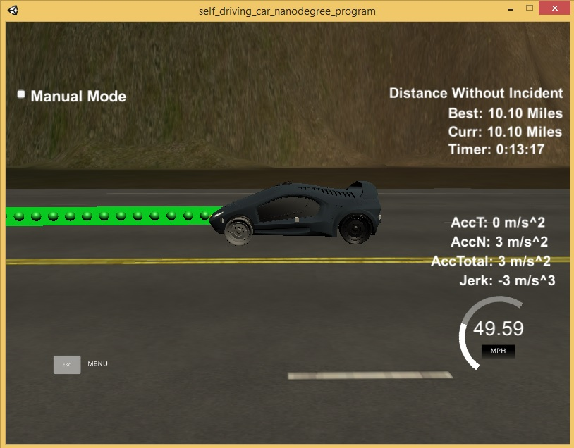
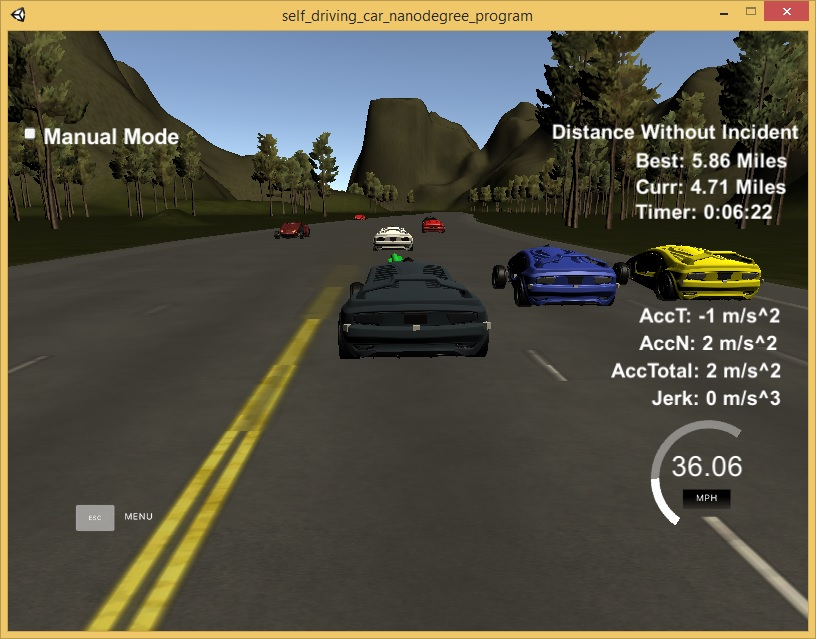
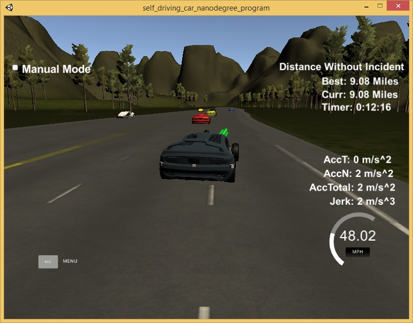

# CarND-Path-Planning-Project
Self-Driving Car Engineer Nanodegree Program
   
### Simulator.
You can download the Term3 Simulator which contains the Path Planning Project from the [releases tab (https://github.com/udacity/self-driving-car-sim/releases).

### Goals
In this project your goal is to safely navigate around a virtual highway with other traffic that is driving +-10 MPH of the 50 MPH speed limit. You will be provided the car's localization and sensor fusion data, there is also a sparse map list of waypoints around the highway. The car should try to go as close as possible to the 50 MPH speed limit, which means passing slower traffic when possible, note that other cars will try to change lanes too. The car should avoid hitting other cars at all cost as well as driving inside of the marked road lanes at all times, unless going from one lane to another. The car should be able to make one complete loop around the 6946m highway. Since the car is trying to go 50 MPH, it should take a little over 5 minutes to complete 1 loop. Also the car should not experience total acceleration over 10 m/s^2 and jerk that is greater than 10 m/s^3.

#### The map of the highway is in data/highway_map.txt
Each waypoint in the list contains  [x,y,s,dx,dy] values. x and y are the waypoint's map coordinate position, the s value is the distance along the road to get to that waypoint in meters, the dx and dy values define the unit normal vector pointing outward of the highway loop.

The highway's waypoints loop around so the frenet s value, distance along the road, goes from 0 to 6945.554.

## Basic Build Instructions

1. Clone this repo.
2. Make a build directory: `mkdir build && cd build`
3. Compile: `cmake .. && make`
4. Run it: `./path_planning`.

Here is the data provided from the Simulator to the C++ Program

#### Main car's localization Data (No Noise)

["x"] The car's x position in map coordinates

["y"] The car's y position in map coordinates

["s"] The car's s position in frenet coordinates

["d"] The car's d position in frenet coordinates

["yaw"] The car's yaw angle in the map

["speed"] The car's speed in MPH

#### Previous path data given to the Planner

//Note: Return the previous list but with processed points removed, can be a nice tool to show how far along
the path has processed since last time. 

["previous_path_x"] The previous list of x points previously given to the simulator

["previous_path_y"] The previous list of y points previously given to the simulator

#### Previous path's end s and d values 

["end_path_s"] The previous list's last point's frenet s value

["end_path_d"] The previous list's last point's frenet d value

#### Sensor Fusion Data, a list of all other car's attributes on the same side of the road. (No Noise)

["sensor_fusion"] A 2d vector of cars and then that car's [car's unique ID, car's x position in map coordinates, car's y position in map coordinates, car's x velocity in m/s, car's y velocity in m/s, car's s position in frenet coordinates, car's d position in frenet coordinates. 

## Results:

The car was able to drive at least 4.32 miles without incident..

The car drives according to the speed limit.

Max Acceleration and Jerk are not Exceeded.

Car does not have collisions. Car was able to slow down when traffic was ahead.

The car stays in its lane, except for the time between changing lanes.

The car is able to change lanes

# Model Documentation: 

This is a reflection on how to generate paths. Here the code model for generating paths is described in detail.

## 1. Obstacle Detection using Sensor Fusion

Nomencalture: LeftMost is Lane 0; Middle is Lane 1; Rightmost is Lane 2

Use the sensor fusion data to check if any obeject is within 35 meters in same lane if so set flag 'too_close' for the corresponding lane to 'TRUE'. 

Also check if there there are any obejcts(car) within 30 meters ahead or behind our car in the adjacent lanes. If so set the flag 'too_close' for those lanes to 'TRUE'

## 2. Lane change State Machine

A state machine is implemented to decide lane shift as given below:

### KEEP LANE: If any object in present lane prepare to change lane
   
   If car is in right most lane: prepare for change left lane
   
   If car is in middle lane: Check if objects (cars) are present in the adjacent lanes, choose the best lane without any cars in adjacent lane too_close for lane change
   
   If car is in left most lane: prepare for change to right lane 

### PREP_LEFT/RIHGT: 
   
   Keep a timer to avoid continuous swith between states.
   
   If no car (object) in adjacent lane, then set the lane change and go to new lane
   
   If objects are in adjacent lanes go back to KEEP_LANE state and reduce speed.

### CHANGE_LANE:
   
   Enter the new lane and gradually ramp up speed to speed limit
   
   Move to KEEP_LANE state.
   
## 3. Accelerate/Slow Down

1. If any car is too close in same lane ahead of our car then slow down

2. If the velocity in less than max speed limit (49.5 miles/hr) then increase teh speed at 0.224 miles/sec

3. During cold start or at low speed apply more acceleration (2x.224miles/sec)

## 4. Path Planning

Use frenet coordinate, add evenly 30m spaced points ahead of the starting reference with 50 points. 

Initially use the car starting reference, else use the previous path's end point as starting reference.

Use Spline for smooth interpolation of points from the start point to the target.

During lane change the new target lane is used to create the trajectory.
